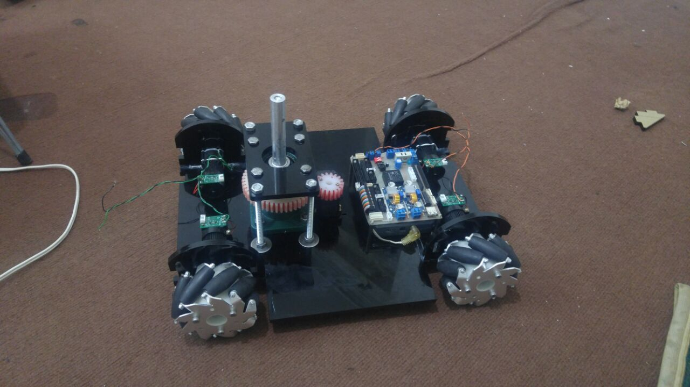
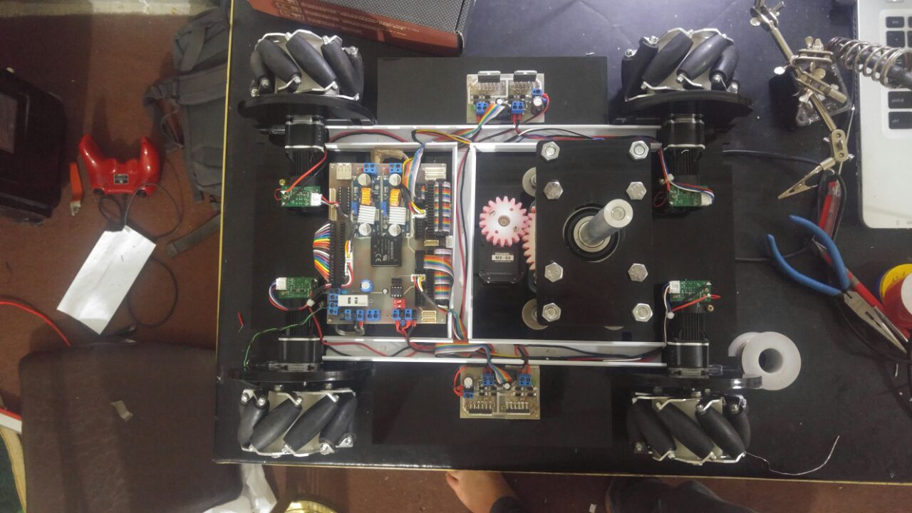
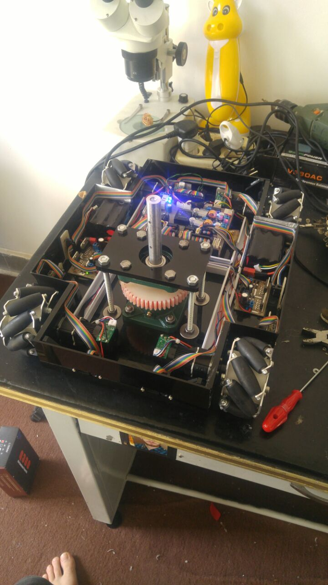
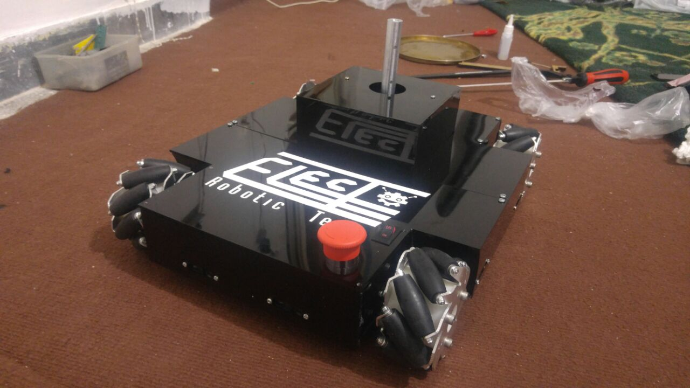
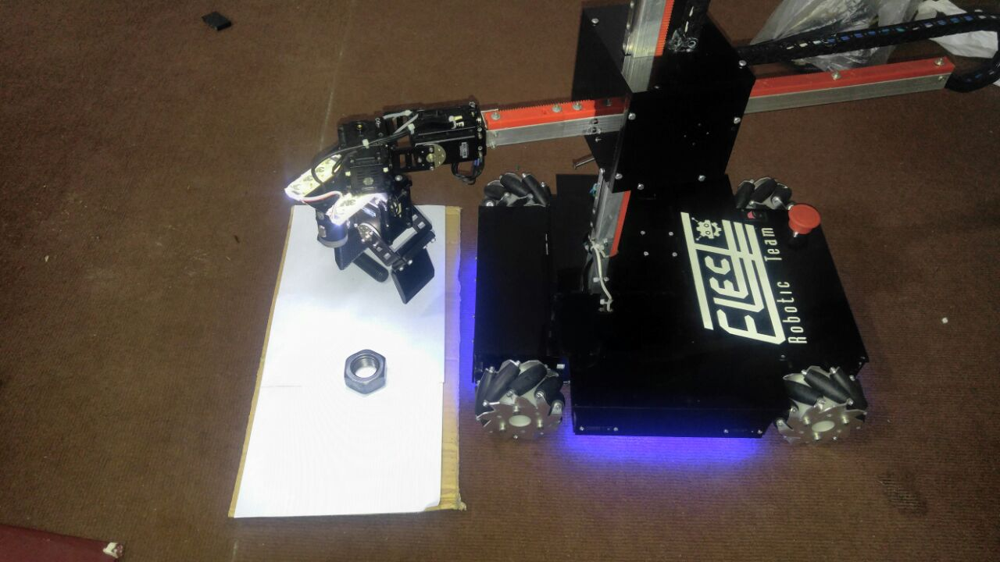
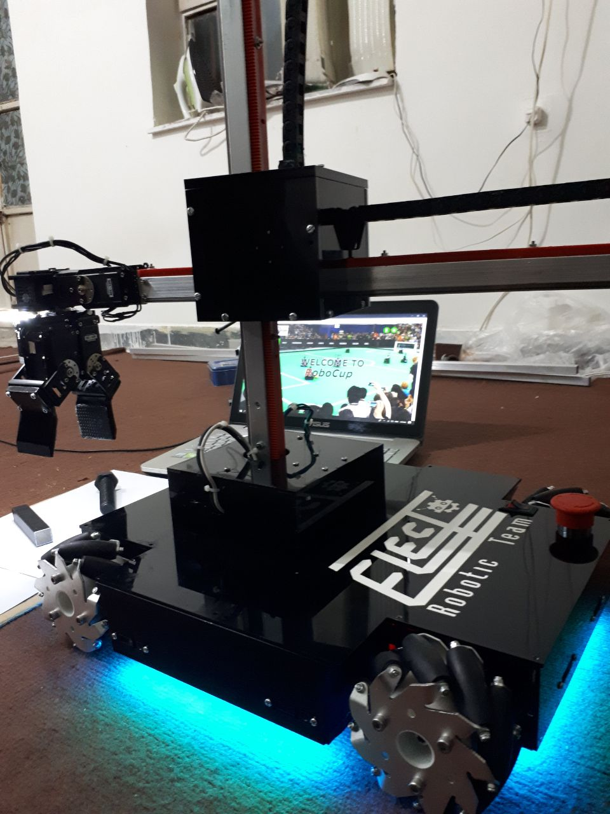
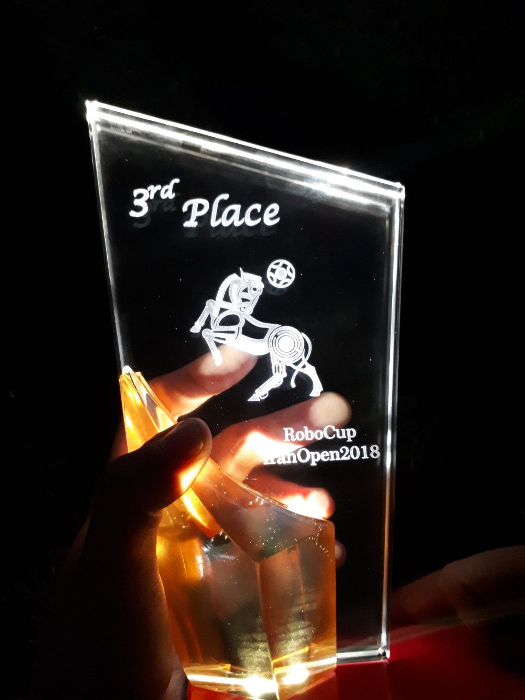

# Robocup 2018 Robot

This project contains the design files and software for a robotics system, developed for RoboCup competition (@Home league). It features a LabVIEW-based control system, custom electronics, and mechanical designs.

## Project Structure

The repository is organized into the following sections:

- **LabVIEW/**: Contains the main control software.
    - **Projects/**: Includes various project files like `Auto control`, `Test`, and `dynamixel` (suggesting the use of Dynamixel smart servos).
    - **Vision Vi/**: VIs related to computer vision processing.
    - **SubVi/**: Reusable sub-programs for modular functionality.

- **PCB/**:
    - **Main/**: Design files for the primary controller board.
    - **Driver/**: Motor driver circuitry.
    - **Sharp/**: Interface board for Sharp IR distance sensors.

- **Mechanical Design/**: CAD files or drawings for the robot's physical structure.
- **Media/**: Documentation images and videos.

## Features

- **Advanced Control**: LabVIEW-based architecture for high-level logic and possibly vision processing.
- **Vision System**: Integrated image processing capabilities (`Vision Vi`).
- **High-Performance Actuation**: likely uses Dynamixel servos for precise movement.
- **Sensor Integration**: PCB designs suggest the use of IR distance sensors (Sharp) and other peripherals.

## Usage

1. **Software**:
   - Open the LabVIEW projects in `LabVIEW/Projects/` to view or run the control code.
   - Ensure NI Vision Development Module is installed for vision components.

2. **Hardware**:
   - Fabricate the PCBs using the designs in the `PCB/` directory.
   - Assemble the mechanical frame according to `Mechanical Design/`.

## Gallery

